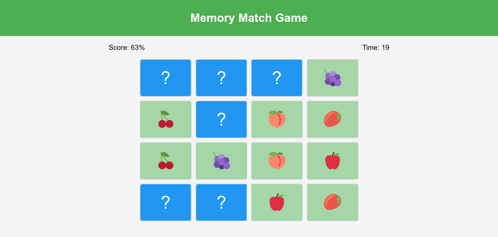
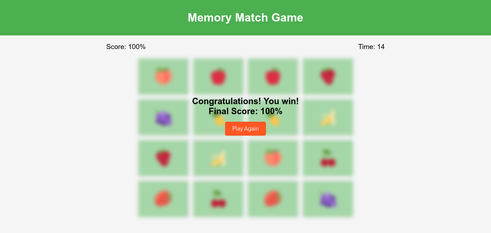

# Memory Match Game

### Play it Now!
[Live Demo](#)

### About
This is a classic Memory Match game built using HTML, CSS, and JavaScript. The game challenges players to find matching pairs of cards as quickly as possible.

### Features
- Multiple Categories: Fruits, Emojis, Animals, Flags, and Famous Landmarks.
- Sound Effects: Card flips, matches, game win and loss.
- Percentage Score: Score displayed as a percentage.
- Timer: Adds a time-based challenge.
- Responsive Design: Playable on different devices.
- Blurred Game-Over Effect: Cards blur when the game ends.

### Screenshot

---

